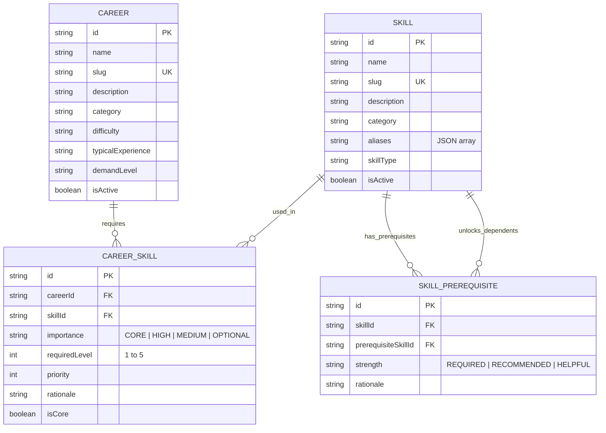

# Career & Skill Knowledge Graph Architecture

## 1. Relational & Graph Schema Design

The knowledge model is implemented using **PostgreSQL + Prisma** (with SQLite support for lightweight local development and testing).



---

## 2. Graph Cycle Detection & DAG Validation

To ensure skill learning progression remains strictly acyclic, PathForge AI enforces multi-level validation:

### 2.1 Self-Prerequisite Prevention

A skill cannot be a prerequisite of itself:
$$\forall s \in S: (s, s) \notin E$$

### 2.2 Direct & Indirect Cycle Prevention

Before inserting a directed edge $(A \to B)$ where $A$ requires $B$:

- The engine runs BFS/DFS starting at $B$ searching for a path to $A$.
- If a path $B \rightsquigarrow A$ already exists, inserting $A \to B$ would complete a cycle $(B \rightsquigarrow A \to B)$.
- The operation is rejected with HTTP `400 Bad Request` and returns the exact circular path.

### 2.3 Full Graph Pre-Validation at Seed Time

During database seeding (`pnpm db:seed`), `validateFullGraph()` verifies that the entire graph is a valid DAG using 3-color DFS traversal ($O(V + E)$).

---

## 3. Query Optimization & Performance

### 3.1 N+1 Query Elimination

Career profiles contain dozens of related skills and prerequisite edges. All endpoints eager-load relations in a single query:

```typescript
const career = await prisma.career.findUnique({
  where: { slug },
  include: {
    skills: {
      include: {
        skill: {
          include: {
            prerequisites: {
              include: { prerequisiteSkill: true },
            },
          },
        },
      },
      orderBy: { priority: 'asc' },
    },
  },
});
```

### 3.2 Strategic Indexes

- Unique index on `Career(slug)` and `Skill(slug)` for $O(1)$ lookups.
- Unique compound index on `CareerSkill(careerId, skillId)` and `SkillPrerequisite(skillId, prerequisiteSkillId)`.
- Foreign key and filter indexes on `category`, `skillType`, and `importance`.

---

## 4. API Surface

| Method | Endpoint                          | Description                                                                      |
| :----- | :-------------------------------- | :------------------------------------------------------------------------------- |
| `GET`  | `/api/careers`                    | List careers with optional `?category`, `?difficulty`, `?demandLevel`, `?search` |
| `GET`  | `/api/careers/:slug`              | Retrieve single career with importance grouping and prerequisite graph           |
| `GET`  | `/api/careers/:slug/skills`       | Retrieve full skill profile with required levels (1–5) and rationales            |
| `GET`  | `/api/skills`                     | List skills with optional `?category`, `?skillType`, `?search` (matches aliases) |
| `GET`  | `/api/skills/:slug`               | Retrieve single skill with prerequisites, dependents, and target careers         |
| `GET`  | `/api/skills/:slug/prerequisites` | Retrieve multi-level hierarchical prerequisite tree                              |
| `GET`  | `/api/skills/:slug/dependents`    | Retrieve all skills that depend on this skill                                    |
| `POST` | `/api/skills/prerequisites`       | Add prerequisite with real-time graph cycle validation                           |
